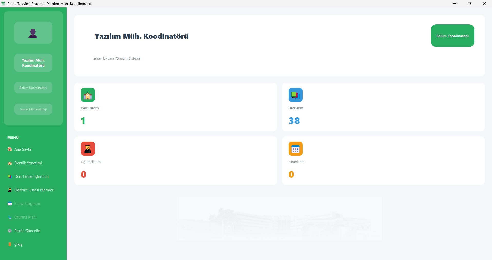
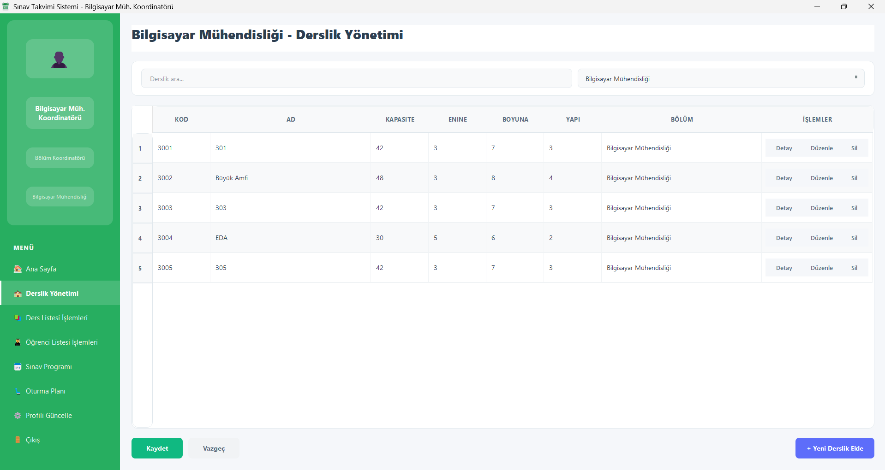
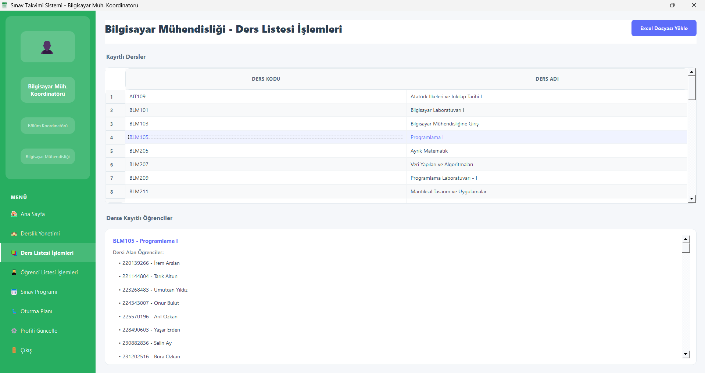
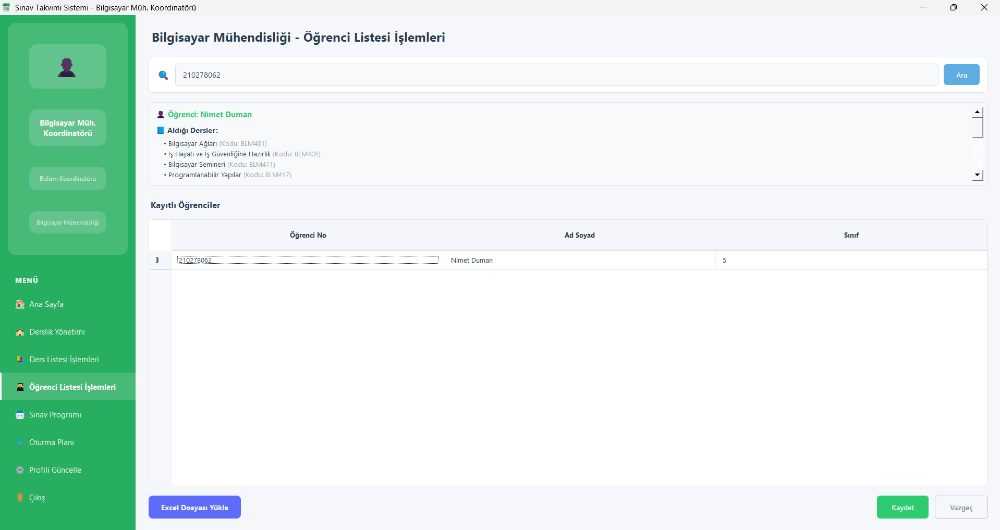
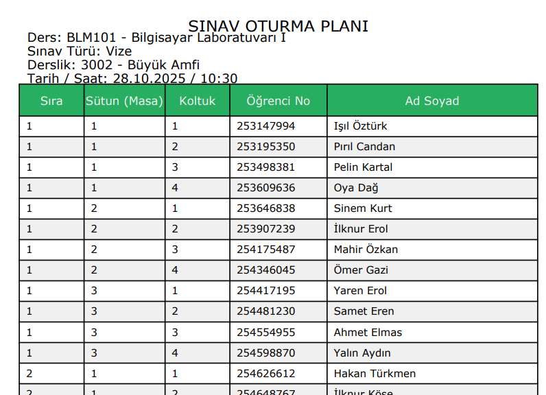
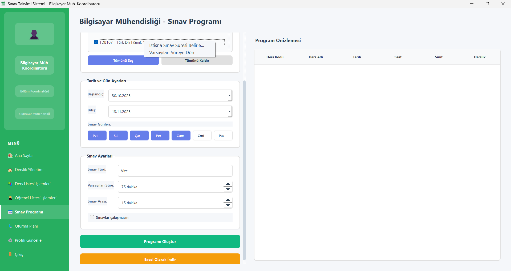
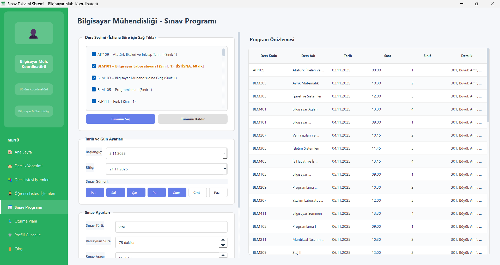
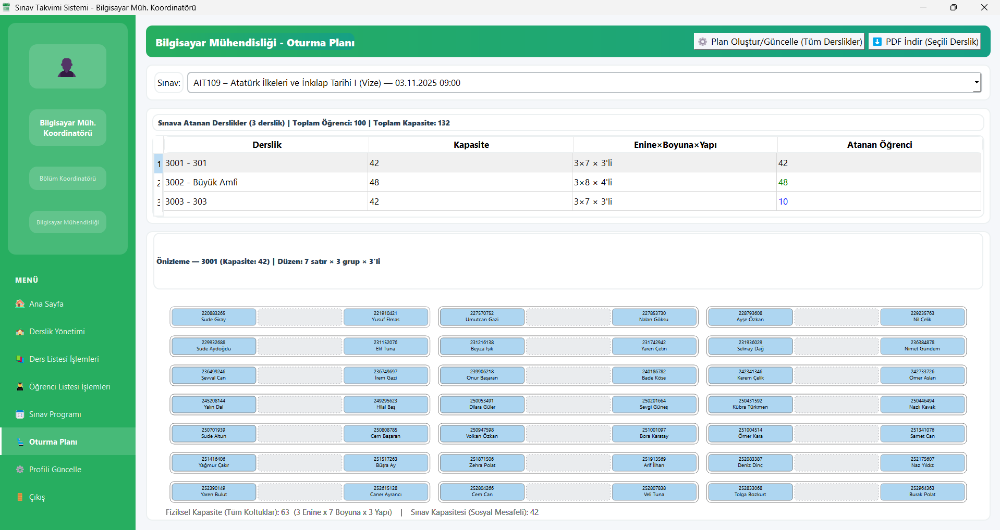

# Dinamik Sınav Takvimi Oluşturma Sistemi

Üniversitelerde sınav takvimlerinin hazırlanması; dersler, öğrenciler, öğretim üyeleri ve derslik kapasiteleri gibi birçok farklı kısıtın eş zamanlı olarak yönetilmesini gerektiren karmaşık bir optimizasyon problemidir. 

**Dinamik Sınav Takvimi Oluşturma Sistemi**, bu süreci otomatize eden kullanıcı dostu bir masaüstü uygulamasıdır. Bölüm koordinatörlerinin Excel formatındaki ders ve öğrenci listelerini sisteme yüklemesine olanak tanır. Geliştirilen planlama algoritması, öğrenci çakışmalarını önleyecek, derslik kullanımını optimize edecek ve akademik kuralları dikkate alacak şekilde otomatik bir sınav programı oluşturur.

## 🚀 Özellikler

- **Derslik Yönetimi:** Sınavların yapılacağı derslikler fiziksel özellikleriyle (kapasite, sütun, satır ve sıra yapısı) sisteme eklenebilir.
- **Excel Entegrasyonu:** Mülakat veya sınav için oluşturulan ders (*hoca, sınıf*) ve öğrenci listeleri (`.xlsx`) kolayca sisteme aktarılır.
- **Otomatik Planlama Motoru:**
  - **Öğrenci Çakışma Kontrolü:** Bir öğrencinin aynı anda veya çakışan saatlerde birden fazla sınava girmesi engellenir.
  - **Sınıf Bazlı Dağılım:** Aynı sınıfa ait öğrencilerin sınavları, öğrencilere çalışma zamanı tanımak amacıyla günlere dengeli bir şekilde dağıtılır.
- **Akıllı Oturma Planı:** Öğrenciler, sosyal mesafe kurallarına ve dersliklerin sıra yapılarına (2'li, 3'lü, 4'lü) göre otomatik olarak yerleştirilir.
- **Zengin Raporlama Seçenekleri:** 
  - Sınav programları **Excel** dosyası olarak dışa aktarılabilir.
  - Sınavlara ve dersliklere özel oturma planları görsel olarak **PDF** belgesine dönüştürülebilir.
- **Yetkilendirme:** Yönetici (Admin) ve Bölüm Koordinatörü rolleri ile çok kullanıcılı şifreli ve güvenli giriş sistemi (`bcrypt`).

## 🛠 Kullanılan Teknolojiler

- **Programlama Dili:** Python (v3.x)
- **Kullanıcı Arayüzü (GUI):** PyQt5
- **Veritabanı:** PostgreSQL (`psycopg2-binary`)
- **Excel & Veri İşleme:** `pandas`, `openpyxl`
- **PDF Çıktı Üretimi:** `reportlab`
- **Güvenlik:** `bcrypt`

## 📸 Ekran Görüntüleri ve Kullanım

### 1. Kullanıcı Giriş Ekranı
Sisteme atanmış rol (Admin / Koordinatör) ile giriş yapılmasını sağlayan güvenli arayüz.


### 2. Yönetim ve Veri Yükleme
Masaüstü uygulaması, veri girildikçe aktifleşen ve yönlendiren dinamik bir menü tasarımına sahiptir.


Koordinatörler veya adminler, veritabanına kolayca derslikleri ve sınav yerlerini tanımlayabilir:


Ayrıca; Excel veri aktarım entegrasyonu sayesinde ders ve öğrenci listeleri kolayca içeri aktarılabilir:


### 3. Sınav Programı Planlama
Algoritmanın çalışması için tarih aralıkları ve optimum sınav süreleri kısıt olarak girilir. Ardından "Programı Oluştur" denildiğinde çakışmalar optimize edilerek takvim çıkarılır ve Excel'e çıktı alınabilir.



### 4. Oturma Planı Çıktıları
Sınav planlandıktan sonra her sınav için sınıf ve oturma planları otomatik görselleştirilir. Bu plan istenirse PDF olarak öğretim üyelerine dağıtılmak üzere dışa aktarılır.




## ⚙️ Kurulum ve Çalıştırma

Projenin kendi bilgisayarınızda çalışması için PostgreSQL veritabanı kurulu olmalıdır.

1. Depoyu klonlayın:
   ```bash
   git clone https://github.com/mervebudakk/StudentExamScheduleSystem.git
   cd StudentExamScheduleSystem
   ```
2. Gerekli kütüphaneleri kurmak için bir sanal ortam oluşturun ve aktif edin:
   ```bash
   python -m venv .venv
   .\.venv\Scripts\activate
   ```
3. Gereksinimleri yükleyin:
   ```bash
   pip install -r requirements.txt
   ```
4. `config.py` içerisindeki veritabanı URL'sini ve ayarlarınızı PostgreSQL ayarlarınıza uygun şekilde düzenleyin. Daha sonra programı başlatın:
   ```bash
   python main.py
   ```
